<div align="center">
  
</div>

<br/>

<div align="center">


[](https://sidharthmn.github.io/portfolio/)
[](https://linkedin.com/in/sidharthmn)
[](https://github.com/SidharthMN)
[](mailto:sidharthnisha7777@gmail.com)
[](https://www.instagram.com/sid.xoid/)

</div>

---

## ✦ About Me

```
current_status   →   Open to Work
education        →   B.Tech CSE · Mohandas College of Engineering & Technology
location         →   Thiruvananthapuram, Kerala, India
interests        →   AI · Computer Vision · Cloud · Full Stack Development
languages        →   English · Malayalam · Hindi · Tamil
projects         →   15+ on GitHub
```

Undergraduate Computer Science Engineer building **real-world software** at the intersection of AI, computer vision, and scalable web systems. From driver safety platforms powered by YOLO to cloud-native fintech apps on AWS — I focus on solving meaningful problems with clarity and intent.

---

## 🛠 Tech Stack

### Languages


### Frontend


### Backend & Frameworks


### AI & Computer Vision


### Cloud & Database


### Tools & Design


---

## 🔥 Featured Projects

### 🚗 [SafeDrive Rewards](https://safedriverewards.netlify.app/) — Driver Safety Platform
> `YOLO` `Python` `OpenCV` `Firebase` `JavaScript` `HTML/CSS`

A gamified driver behavior monitoring platform using YOLO-based vehicle and license plate detection. Real-time video analysis pipeline achieving **4–5 FPS** for smart-city applications. Firebase-powered cloud backend with an automated reward point system.

`90% Detection Accuracy` · `4–5 FPS Real-time` · `AI · Computer Vision`

---

### 🎬 [VaakMitra](https://github.com/SidharthMN/vaakmitra--An-AI-OTT-LIVE-EN-ML-TRANSLATING-PLATFORM) — AI OTT Dubbing Platform
> `Flask` `Google TTS` `Speech-to-Text` `FFmpeg`

Scalable Python Flask backend for automated **Malayalam audio dubbing** and subtitle generation. Integrates Google Speech-to-Text and TTS APIs with translation workflows for efficient subtitle synchronization and multilingual audio processing.

`100% Working` · `Real-time Translation` · `Frontend · NLP`

---

### ☁️ [Xpenz](https://github.com/SidharthMN/xpenz-fintech) — AWS Cloud Expense Tracker
> `React Vite` `Tailwind CSS` `AWS Lambda` `DynamoDB` `API Gateway` `Electron`

Cloud-native fintech expense tracking app with a fully serverless backend. Interactive SaaS-style dashboard with charts, transaction tracking, and responsive UI. Deployable as both a **web app and desktop software** via Electron.

`100% Working · Deployable as Web + Desktop` · `Fintech · Cloudware`

---

### 🌐 [Personal Portfolio](https://sidharthmn.github.io/portfolio/)
> Custom-built from scratch with a minimalist, editorial aesthetic. Responsive design with smooth animations and a unique retro-terminal identity.

---

## 💼 Experience

**Intern — Web Development** · [Cognifyz Technologies](https://drive.google.com/file/d/1RIt7Yu1WjO6ODloH0PyjWr3hHXfVC4L4/view?usp=sharing) · *Dec 2025 – Jan 2026 · Remote*
- Developed responsive web applications using HTML, CSS, JavaScript, and Bootstrap
- Delivered technical tasks within strict deadlines to meet organizational goals

**Intern — Cloud & Web** · [Teachnook](https://drive.google.com/file/d/1HWrc3T3e3GkTiyGJLdBJYV4Qz7jSNBZR/view?usp=sharing) · *Mar 2024 – Apr 2024 · Remote*
- Deployed web applications on AWS EC2 using Amazon Windows environments
- Managed server configurations and AWS S3 storage for application hosting

---

## 🏅 Certifications

| Certificate | Issuer | Skill |
|---|---|---|
| [Developer & Technology Job Simulation](https://www.theforage.com/completion-certificates/ovyvuqqNRQKBjNxbj/3xnZEj9kfpoQKW885_ovyvuqqNRQKBjNxbj_690876d91d2a7bdbffeb9e57_1765427614300_completion_certificate.pdf) | Accenture UK · Forage | Responsive Web Design |
| [Data Analytics Job Simulation](https://www.theforage.com/completion-certificates/9PBTqmSxAf6zZTseP/io9DzWKe3PTsiS6GG_9PBTqmSxAf6zZTseP_690876d91d2a7bdbffeb9e57_1762184012491_completion_certificate.pdf) | Deloitte Australia · Forage | Data Science |
| Web Development Bootcamp | Udemy · Dr. Angela Yu | Full Stack Web Dev |

---

## 📊 GitHub Stats

<div align="center">


</div>

---

## 🌐 Connect

<div align="center">

| | |
|---|---|
| 🌍 Portfolio | [sidharthmn.github.io/portfolio](https://sidharthmn.github.io/portfolio/) |
| 💼 LinkedIn | [linkedin.com/in/sidharthmn](https://linkedin.com/in/sidharthmn) |
| 🐙 GitHub | [github.com/SidharthMN](https://github.com/SidharthMN) |
| 📸 Instagram | [@sid.soid](https://www.instagram.com/sid.xoid/) |
| 📧 Email | sidharthnisha7777@gmail.com |
| 📞 Phone | +91 81291 53915 |

</div>

---

<div align="center">

```
SIDXOID® · © 2026 Sidharth M N · Thiruvananthapuram, Kerala
```

*Crafting digital systems with clarity & intent.*

</div>
